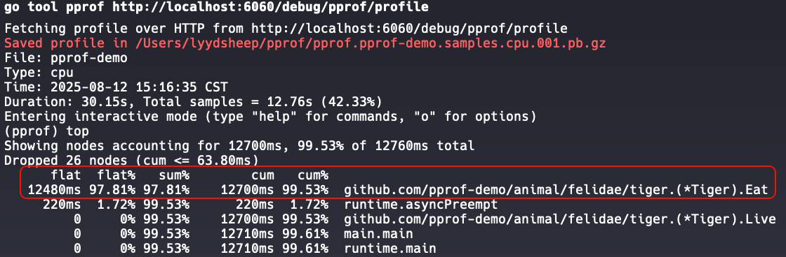
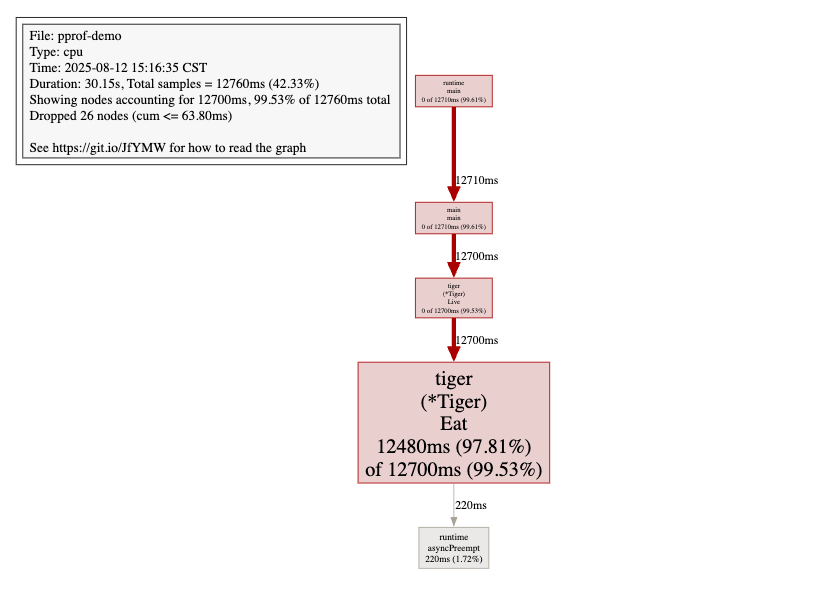
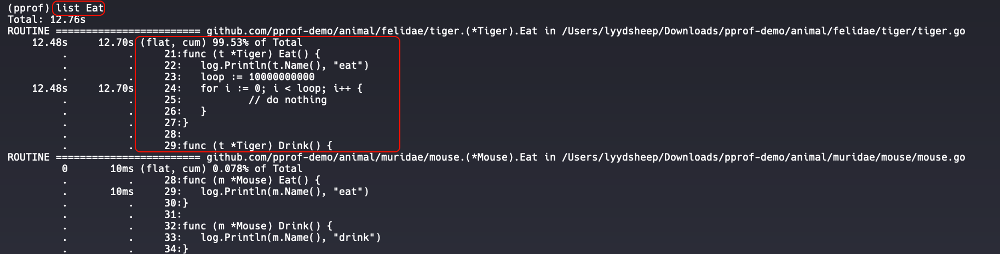

# Go 项目实践

## 项目简介

这是一个综合性的 Go 语言实践项目，包含新版本特性实践、代码题解答以及经典线上问题排查方法。

## 项目结构

```
├── feature/   # 特性实践相关代码
├── pkg/       # 工具包
├── questions/ # 代码题解答
├── go.mod     # Go 模块文件
└── main.go    # 主程序入口
```

## 主要内容

### 1. Go 新版本特性实践

- `json/v1` 和 `json/v2`: 流式处理 JSON 数据

### 2. 代码题

`questions` 目录下包含了多个 Go 语言代码题的解答，每题对应一个文件：

- [Q1](./questions/q1.go)：使用三个协程，每秒钟打印轮流打印 ABC
- [Q2](./questions/q2.go)：实现两个协程轮流输出 A1B2C3 ... Z26
- [Q3](./questions/q3.go)：考察切片的长度和容量特性
- [Q4](./questions/q4.go)：考察 GMP 协程调度过程
- [Q5](./questions/q5.go)：用两个协程分别计算数组中偶数和与奇数和
- [Q6](./questions/q6.go)：多个协程执行随机数加法并找出最大值
- [Q7](./questions/q7.go)：10个协程按规则打印数字（0～100000）
- [Q8](./questions/q8.go)：实现一个协程池
- [Q9](./questions/q9.go)：实现堆排序算法

### 3. Go程序性能调优

#### 在 Go 程序中，有哪些调优内容？

1. 服务器资源问题
    - [x] CPU：CPU 飙高，影响整个服务器性能
    - [x] 内存：内存是否泄露、是否会 OOM
2. 程序问题
    - [ ] goroutine：是否存在协程过多、协程泄露情况
    - [ ] deadlock：是否存在死锁
    - [ ] data race detector：并发情况下，是否存在数据竞争
    - [x] GC：是否频繁 GC

#### 性能优化实践

##### 排查 CPU 占用过高

1. 进入交互式终端：`go tool pprof http://host:port/debug/pprof/profile`
2. 使用 `top` 或 `web` 命令查看 CPU 占用情况。
    - 关键看`flat` 指标，值越高， CPU 占用越高。
      
    - `web` 命令需要实现安装 `graphviz`，才能进行对数据可视化。
      
3. 使用 `list` 命令查看 CPU 占用过高的函数。


## 贡献

欢迎提交代码和建议，一起完善这个项目！